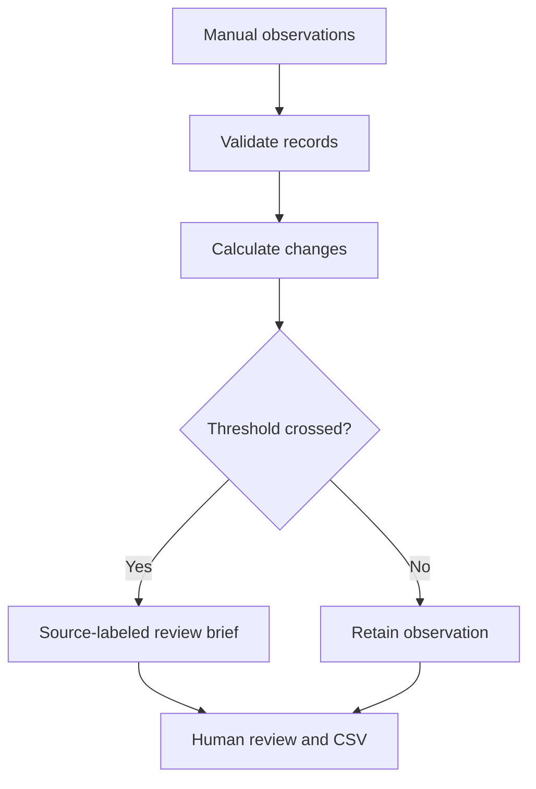
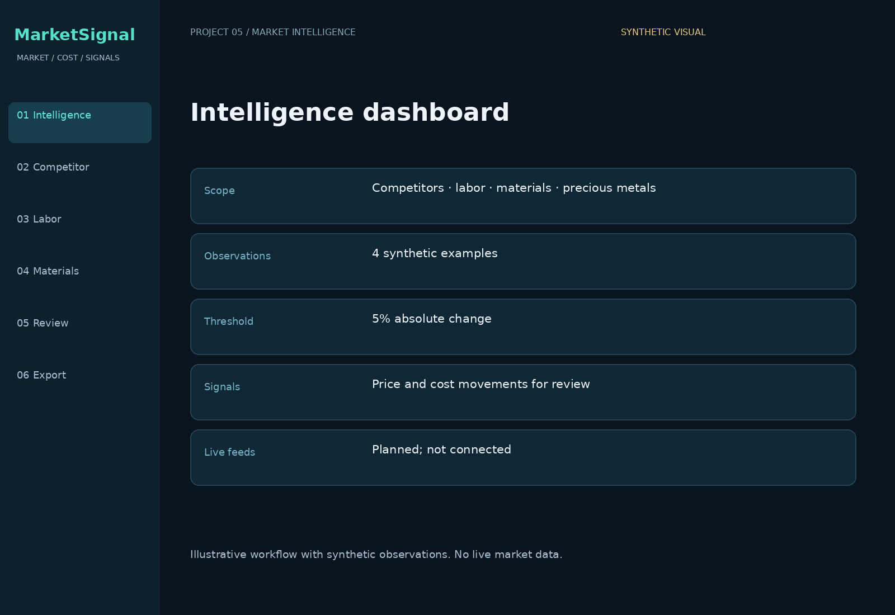
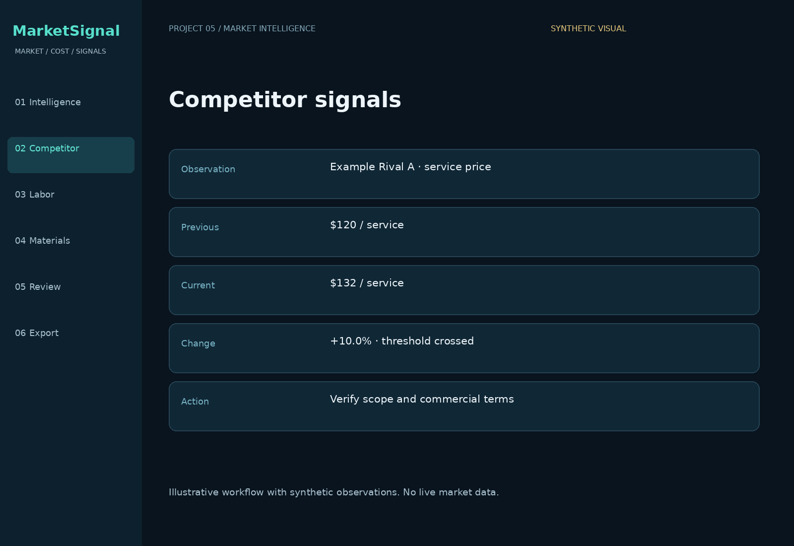
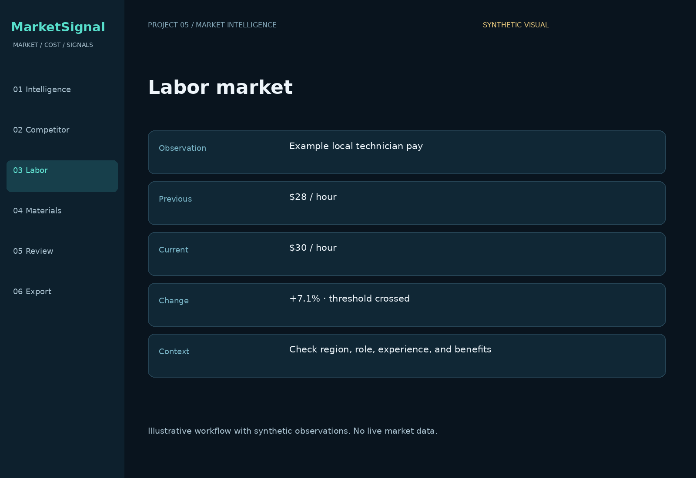
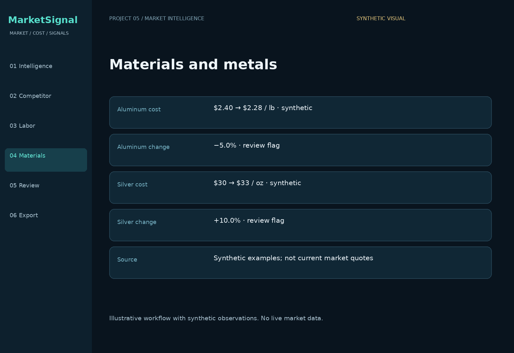
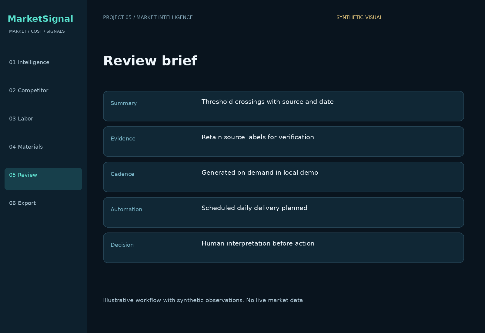
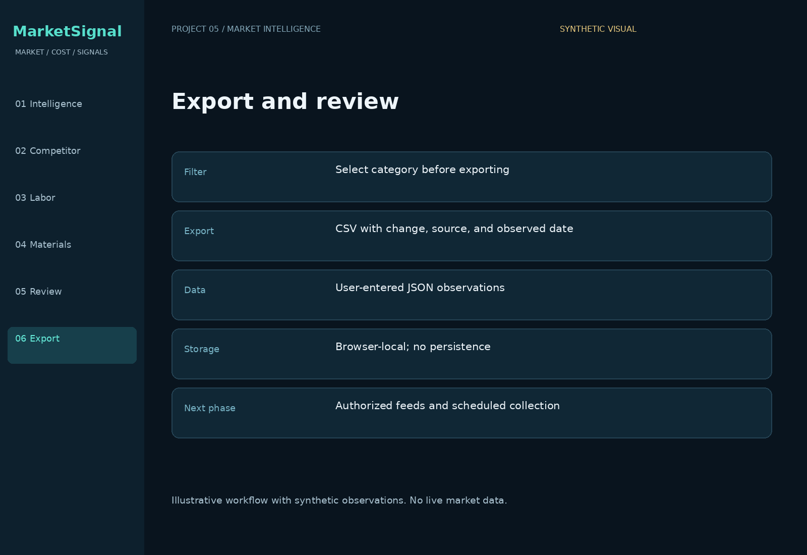

# MarketSignal — Competitive & Market Intelligence

**Federico Veneziano · Portfolio Project #5**

A local intelligence-review prototype for comparing competitor prices, labor rates, material costs, and precious-metal costs. It calculates changes, highlights threshold crossings, creates a source-labeled review brief, and exports selected observations.

## Business problem
Market information often lives across supplier quotes, job postings, competitor websites, and spreadsheets. Operators need a consistent way to compare observations and identify which changes deserve attention.

## Working features
- Paste structured JSON observations with a previous/current value, unit, source, and date.
- Validate inputs and calculate percentage changes.
- Set an absolute change threshold and filter by category.
- Generate a deterministic review brief with source labels and observed dates.
- Export the selected category to CSV.

## Implementation status
| Capability | Status |
|---|---|
| Manual observation intake and validation | Implemented locally |
| Percentage change and threshold flags | Implemented |
| Category filters, review brief, CSV export | Implemented |
| Live feeds, website monitoring, scraping | Planned |
| Scheduled daily collection and email delivery | Planned |
| LLM synthesis, review sentiment, service discovery | Planned |

**All included observations are synthetic.** No live data, AI calls, financial recommendation, or production performance result is claimed. A change flag is a prompt for review. The demo does not verify source authenticity, observation dates, units, or commercial comparability. Percentage changes are meaningful only for comparable observations.

## Run
Open `demo/index.html` in a browser. No installation or account needed. Review the sample, change the threshold, filter a category, and export a CSV. Reload resets edits.

## Workflow

## Portfolio visuals
Illustrated workflow views with synthetic values, not live application screenshots or current market quotes.

### Intelligence dashboard

### Competitor signals

### Labor market

### Materials and metals

### Review brief

### Export and review

## Files
- `demo/index.html`: browser demo.
- `src/intelligence.js`: validation, calculations, briefing, CSV helpers.
- `examples/sample-observations.json`: synthetic sample.
- `docs/architecture.md`: current and proposed data flow.
- `docs/case-study.md`: problem, approach, and measurement plan.
- `docs/data-contract.md`: required fields and comparison assumptions.
- `tests/intelligence.test.cjs`: automated logic checks.

Run checks: `node tests/intelligence.test.cjs`.

## Skills demonstrated
Operational intelligence · competitive analysis workflow · cost monitoring · quantitative analysis · evidence review · input validation · automation architecture.
